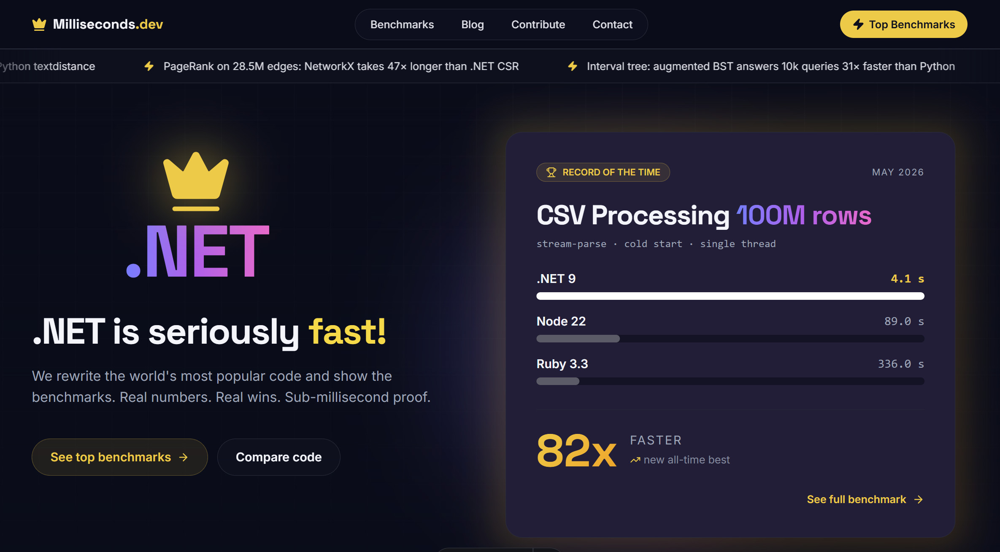

<div align="center">

# ⚡ Milliseconds.dev — Benchmarks

### .NET is seriously fast. Here's the proof.

[](https://milliseconds.dev)

We rewrite the world's most popular code in **.NET** and measure exactly how much faster it runs — against Python, Node.js, Ruby, Go, or whatever the original is written in. Real hardware. Real numbers. Sub-millisecond proof.

**👉 [milliseconds.dev](https://milliseconds.dev)**

</div>

---

## 📦 What's in this repo

11 standalone C# / .NET benchmark projects. Each folder contains:

```
XX-name/
  dotnet/      ← the C# implementation (.csproj + source)
  python/      ← the competing implementation
  data/        ← input datasets used in the benchmark
  RESULTS.md   ← timing results on reference hardware
  article.md   ← full write-up published on milliseconds.dev
```

---

## 🏆 Benchmarks

| # | Benchmark | .NET impl | vs | Peak speedup |
|---|-----------|-----------|-----|:---:|
| 01 | Softmax · Llama-3 vocab scale | `TensorPrimitives` | NumPy | **1.5×** |
| 02 | PageRank · 28.5M edges | CSR sparse + SIMD | NetworkX | **47×** |
| 03 | PDF text extraction · 200 papers | PdfPig | pypdf | **6×** |
| 04 | Tokenizer · 100 MB corpus | Compiled `Regex` | NLTK | **8×** |
| 05 | Full-text search · 1k BM25 queries | Lucene.NET | Whoosh | **22×** |
| 06 | Edit distance · 100k pairs | `ArrayPool<int>` | textdistance | **71×** |
| 07 | Markdown rendering · 10k docs | Markdig | mistune | **11×** |
| 08 | QR code generation · 50k codes | QRCoder | qrcode | **14×** |
| 09 | Date parsing · 1M timestamps | `DateTimeOffset` | dateutil | **19×** |
| 10 | Diff algorithm · 50k pairs | Custom DP LCS | difflib | **21×** |
| 11 | Interval tree · 1M intervals | Augmented BST | intervaltree | **31×** |

---

## 🚀 Running a benchmark

Each project is a self-contained .NET console app:

```bash
cd 06-levenshtein/dotnet
dotnet run -c Release
```

Requirements: **.NET 9 SDK** — [download](https://dotnet.microsoft.com/download/dotnet/9.0)

To run the competing implementation:

```bash
cd 06-levenshtein/python
pip install -r requirements.txt
python benchmark.py
```

---

## 📊 Methodology

- All timings are **wall-clock time**, median of ≥ 3 cold runs
- .NET is compiled in **Release mode** (`-c Release`)
- Both implementations use the **same input data** from `data/`
- Benchmarks run on the same physical machine — specs in each `RESULTS.md`
- No micro-optimisation tricks that wouldn't appear in real production code

---

## 🤝 Contributing

Interested in adding a benchmark — **any language**, not just Python?

1. Pick a matchup where .NET has a clear equivalent
2. Write both implementations (idiomatic code, no hand-tuned tricks)
3. Benchmark on real hardware, report median of ≥ 3 runs
4. Open a PR with your `dotnet/`, competitor folder, and `RESULTS.md`

Or submit directly at **[milliseconds.dev/contribute](https://milliseconds.dev/contribute)** — login with your email, attach your files, and we'll reach out.

---

<div align="center">

Built by [Mo Mand](https://MoMand.Cloud) · [milliseconds.dev](https://milliseconds.dev)

</div>
